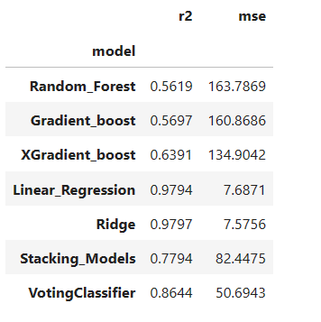

# Predicting Stock Price With Regression Modeling

Predicting stock movement and stock price for a company is complicated and tricky because it is reflected and impacted by multiple factors such as the country's economic situation, company’s financial performance,nonlinear stock market and unexpected circumstances etc. However, in recent ages where financial institutions  have embraced artificial intelligence as a core part of their operations, predicting stock prices through machine learning is gaining popularity for researchers as these machine based models and algorithms have the ability to learn from historical data and based upon that make future predictions. In our this class  project we have implemented various machine learning regression models to predict stock market prices during a short run (i.e. next day) by using technical analysis as our predicting methodology. We tested these models for the stocks that are consistent over the time e.g. ‘TSLA’, ‘TGT’,’GOOG’ and tickers with large up and down price swings e.g. ‘AAPL’, ‘MSFT’. Our models have shown persistent accuracy staying above 90% in making predictions for historically consistent stocks while for AAPL and similar stocks  accuracy varied between 65-78%. Our next step would be to hone into hyper-parameters and estimators to help train our models more effectively.

| TARGET-ALL MODELS PREDICTION PERFORMANCE                      | APPLE-ALL MODELS PREDICTION PERFORMANCE                |
| -----------------------------------                           | -----------------------------------                    |
|                           |                   |

## Imports

* from finta import TA
* from sklearn.preprocessing import StandardScaler
* from sklearn.model_selection import GridSearchCV
* from sklearn.ensemble import (RandomForestRegressor,GradientBoostingRegressor,StackingRegressor,VotingRegressor)
* from sklearn.linear_model import (LinearRegression,Ridge)
* from sklearn import metrics
* import xgboost as xgb
* from xgboost.sklearn import XGBRegressor
* import quantstats as qs

## Data Overview:

Historical market Data for the desired tickers was extracted from yahoo finance from Feb 2012 to Feb 2024. Models were trained in the first 10 years while the last two years were used to test our model predictions. 

### Featuring Engineering & Data Pre-processing:

As stated above, we used technical analysis to demonstrate machine based predictions. For that we calculated various technical indicators such as Simple Moving Average(SMA), Double Exponential Moving Average (DEMA), RSI, MACD and STOCH based upon our literature survey,online resources and general understanding. The windows were set as are generally used for short, medium and long term basis.

To make our features more digestible for the models and to make all variables contribute equally to the model we standardized feature columns through scikit-learn’s StandardScaler. StandardScaler removes the mean and scales each feature/variable to unit variance. This operation is performed feature-wise in an independent way. However, it can be influenced by outliers (if they exist in the dataset) since it involves the estimation of the empirical mean and standard deviation of each feature(1).

# Model Implementation

## GRIDSEARCHCV

Grid Search is a hyperparameter technique used in  machine-learning to fine tune our algorithms. Grid Search performs multiple computations on the combination of  hyperparameters that are available on every machine learning algorithm and enables us to configure the optimal parameters for a given model.  This function comes in the SK-learn model selection package. Apart from helping us achieve better results, Grid Search gives us an evaluated metric system, which gives us better insights into our machine-learning model(2).

| GRIDSEARCHCV                        |
| ----------------------------------- |                          
|     | 

### 
https://scikit-learn.org/stable/modules/generated/sklearn.model_selection.GridSearchCV.html

## Random Forest

https://scikit-learn.org/stable/modules/generated/sklearn.ensemble.RandomForestRegressor.html

## Gradient_Boost

###

https://scikit-learn.org/stable/modules/generated/sklearn.ensemble.GradientBoostingRegressor.html

## XGradient_Boost

###

https://xgboost.readthedocs.io/en/latest/install.html

## Linear_Regression

###

https://scikit-learn.org/stable/modules/generated/sklearn.linear_model.LinearRegression.html

## Ridge

###

https://scikit-learn.org/stable/modules/generated/sklearn.linear_model.Ridge.html

# Model Ensembling 

Ensemble learning is a machine learning technique that enhances accuracy, strength and predictive performance by aggregating  predictions from multiple models.Three main classes of ensemble learning methods are bagging, stacking, and boosting. This project accomplished stacking Regressor and  Voting Regressor ensemblers from SK-learn.ensembles and created Random Forest Regressor, XGBoostRegressor, GradientBoost Regressor, Linear Regression and Ridge Regression models for stacking up.

As voting and stacking combines the performance of multiple models that helps to reduce the hidden biased parameters and misclassification of models at large. It also mitigates the risk of inaccurate predictions by having other models that can backup the weak learners. However combining multiple models is computation intensive and their training and implementation can increase cost significantly. Additionally, if the dataset is linear data then voting techniques would undermine the accuracy predictions performed by linear regression models.   

## StackingRegressor

StackingRegressor is fitting many different models on the same data and then making the best predictions through a final estimating model called meta learner. Meta learner attempts to minimize the weekness and maximize teh strength of every individual model that helps to generlize the model on an unseen data set very well as compared to an individual model. 

| Understanding Stacking Ensembling   |
| ----------------------------------- |  
|    | 

https://scikit-learn.org/stable/modules/generated/sklearn.ensemble.StackingRegressor.html

## VotingRegressor

Scikit-Learn provides a VotingRegressor() class that allows us to use voting ensemble learning methods. For regression, voting ensemble involves making a prediction that is average of other multiple regression models. Whereas in classification modeling it involves hard and soft voting strategies to determine the final predictor.  Hard voting is choosing the class that receives the majority of votes as the final predictor while soft voting takes the weighted average of the predicted probabilities to make the final prediction.

| Understanding Voting Ensembling            | 
| -----------------------------------        | 
|     |

https://scikit-learn.org/stable/modules/generated/sklearn.ensemble.VotingRegressor.html

## Validation of Training & Testing Data     

|Optimized Model Performance--TARGET                       | Optimized Model Performance--Apple
| ---------------------------------------------            | -----------------------------------  
|                 |

## Summary

|All Model Testing Performance--TARGET                     | All Model Testing Performance--Apple
| ---------------------------------------------            | -----------------------------------  
|                          |

References:
1. https://towardsdatascience.com/how-and-why-to-standardize-your-data-996926c2c832#:~:text=StandardScaler%20removes%20the%20mean%20and,standard%20deviation%20of%20each%20feature.
https://builtin.com/machine-learning/ensemble-model

2. https://www.scaler.com/topics/machine-learning/grid-search-in-machine-learning/

3. https://scikit-learn.org/stable/modules/generated/sklearn.ensemble.StackingRegressor.html

4.  https://builtin.com/machine-learning/ensemble-model

5.  https://www.kaggle.com/code/jayatou/xgbregressor-with-gridsearchcv

6. https://towardsdatascience.com/combining-tree-based-models-with-a-linear-baseline-model-to-improve-extrapolation-c100bd448628#:~:text=In%20our%20case%20we%20will,the%20go%2Dto%2Dmodel.

